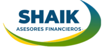

<h1>Landing Page de Shaik Asesores</h1>

<h2> Descripción del Proyecto </h2>
Este proyecto consiste en la creación de una Landing Page para Shaik Asesores, una empresa panameña dedicada a brindar asesoramiento en préstamos personales. La página web está diseñada para ofrecer información sobre los servicios de la empresa y facilitar a los visitantes la solicitud de cotizaciones y más detalles sobre los préstamos personales que ofrecen.

<h2>Tecnologías Utilizadas</h2>
HTML: La estructura de la página se ha creado utilizando HTML para garantizar una base sólida y accesible.

CSS: El diseño y la apariencia visual de la página se han mejorado con CSS para lograr un aspecto atractivo y coherente.

JavaScript: Se ha utilizado JavaScript para implementar interacciones dinámicas en la página y para facilitar la comunicación con los visitantes a través de WhatsApp y correo electrónico.

<h2>Funcionalidades Clave</h2>
Cotización Rápida: Los visitantes pueden solicitar una cotización de préstamo rápida haciendo clic en el botón "¡Cotiza ya!" en la parte superior de la página.

Información Clara: La página presenta información clara y concisa sobre los servicios de Shaik Asesores y los tipos de préstamos personales que ofrecen.

Enlace a WhatsApp: Al hacer clic en el botón "¡Cotiza ya!" en la parte superior de la página, se abre una ventana de WhatsApp con el número de teléfono y un mensaje predefinido, facilitando a los usuarios la solicitud de una cotización.

Redes Sociales: Se invita a los usuarios a seguir a Shaik Asesores en sus redes sociales, como Instagram y correo electrónico.

<h2>Autor</h2>
Este proyecto fue realizado por YeraldinShaik.

